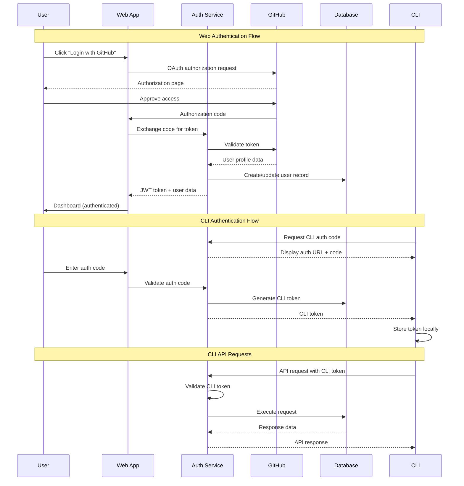

# Authentication and Authorization

### Auth Flow


### Middleware/Guards
```python
from fastapi import Depends, HTTPException, status
from fastapi.security import HTTPBearer, HTTPAuthorizationCredentials
from sqlalchemy.orm import Session
from jose import JWTError, jwt
from typing import Optional

from ..core.config import settings
from ..core.database import get_db
from ..models.user import User

security = HTTPBearer()

async def get_current_user(
    credentials: HTTPAuthorizationCredentials = Depends(security),
    db: Session = Depends(get_db)
) -> User:
    """Get current authenticated user from JWT token."""
    credentials_exception = HTTPException(
        status_code=status.HTTP_401_UNAUTHORIZED,
        detail="Could not validate credentials",
        headers={"WWW-Authenticate": "Bearer"},
    )
    
    try:
        # Try JWT token first (web authentication)
        payload = jwt.decode(
            credentials.credentials, 
            settings.SECRET_KEY, 
            algorithms=[settings.ALGORITHM]
        )
        user_id: str = payload.get("sub")
        if user_id is None:
            raise credentials_exception
            
        user = db.query(User).filter(User.id == user_id).first()
        if user is None:
            raise credentials_exception
            
        return user
        
    except JWTError:
        # Try CLI token (CLI authentication)
        user = db.query(User).filter(User.cli_token == credentials.credentials).first()
        if user is None:
            raise credentials_exception
        
        # Update last active timestamp for CLI users
        user.last_active = datetime.utcnow()
        db.commit()
        
        return user

async def get_current_active_user(
    current_user: User = Depends(get_current_user)
) -> User:
    """Ensure user is active."""
    return current_user

async def require_team_access(
    team_id: str,
    current_user: User = Depends(get_current_user),
    db: Session = Depends(get_db)
) -> None:
    """Require user has access to specified team."""
    # Check if user owns the team
    team = db.query(Team).filter(
        and_(Team.id == team_id, Team.owner_id == current_user.id)
    ).first()
    
    if team:
        return
    
    # Check if user is a team member
    membership = db.query(TeamMember).filter(
        and_(
            TeamMember.team_id == team_id,
            TeamMember.user_id == current_user.id
        )
    ).first()
    
    if not membership:
        raise HTTPException(
            status_code=status.HTTP_403_FORBIDDEN,
            detail="Access denied to team"
        )

class RequireRole:
    """Dependency to require specific team role."""
    
    def __init__(self, required_role: str):
        self.required_role = required_role
    
    async def __call__(
        self,
        team_id: str,
        current_user: User = Depends(get_current_user),
        db: Session = Depends(get_db)
    ):
        membership = db.query(TeamMember).filter(
            and_(
                TeamMember.team_id == team_id,
                TeamMember.user_id == current_user.id
            )
        ).first()
        
        if not membership or membership.role != self.required_role:
            raise HTTPException(
                status_code=status.HTTP_403_FORBIDDEN,
                detail=f"Required role: {self.required_role}"
            )

# Usage examples
require_admin = RequireRole("admin")
require_editor = RequireRole("editor")
```

