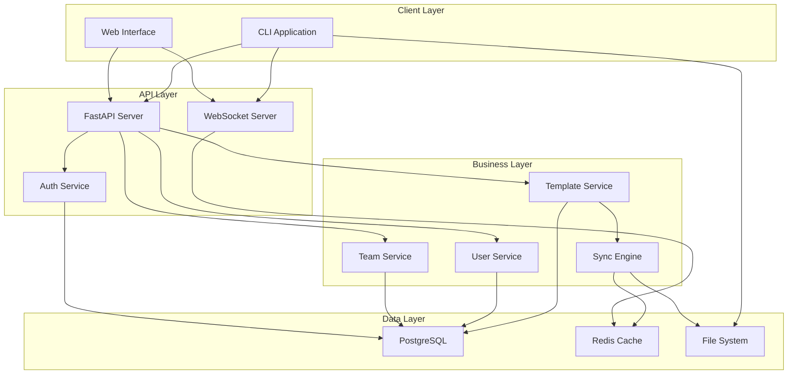

# Component Diagrams

```mermaid
graph TB
    subgraph "Client Layer"
        A[CLI Application]
        B[Web Interface]
    end
    
    subgraph "API Layer"
        C[FastAPI Server]
        D[WebSocket Server]
        E[Auth Service]
    end
    
    subgraph "Business Layer"
        F[Template Service]
        G[User Service]
        H[Team Service]
        I[Sync Engine]
    end
    
    subgraph "Data Layer"
        J[PostgreSQL]
        K[Redis Cache]
        L[File System]
    end
    
    A --> C
    A --> D
    A --> L
    B --> C
    B --> D
    
    C --> E
    C --> F
    C --> G
    C --> H
    
    F --> I
    F --> J
    G --> J
    H --> J
    I --> L
    I --> K
    
    E --> J
    D --> K
```

