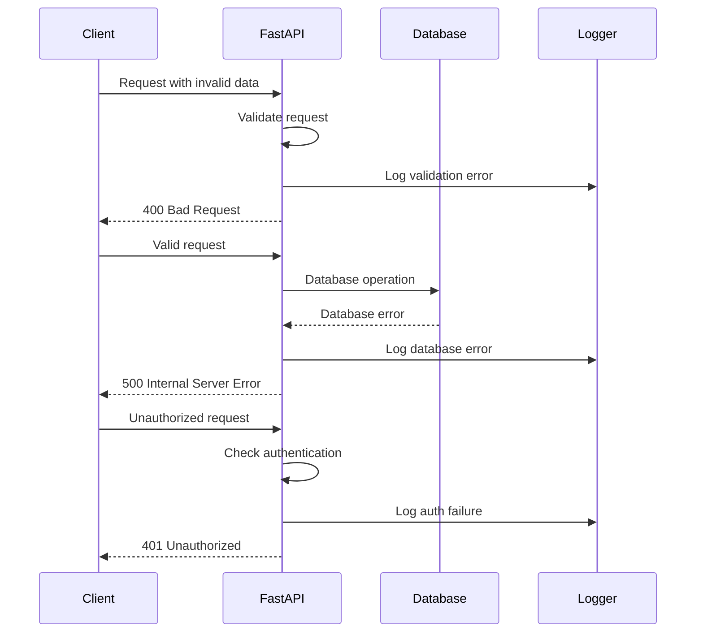

# Error Flow

```mermaid
sequenceDiagram
    participant C as Client
    participant API as FastAPI
    participant DB as Database
    participant Log as Logger

    C->>API: Request with invalid data
    API->>API: Validate request
    API->>Log: Log validation error
    API-->>C: 400 Bad Request

    C->>API: Valid request
    API->>DB: Database operation
    DB-->>API: Database error
    API->>Log: Log database error
    API-->>C: 500 Internal Server Error

    C->>API: Unauthorized request
    API->>API: Check authentication
    API->>Log: Log auth failure
    API-->>C: 401 Unauthorized
```

