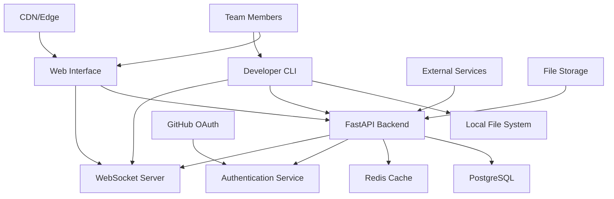

# High Level Architecture Diagram

```mermaid
graph TD
    A[Developer CLI] --> B[Local File System]
    A --> C[FastAPI Backend]
    
    D[Web Interface] --> C
    C --> E[PostgreSQL]
    C --> F[Redis Cache]
    C --> G[Authentication Service]
    
    H[Team Members] --> D
    H --> A
    
    I[External Services] --> C
    J[GitHub OAuth] --> G
    
    C --> K[WebSocket Server]
    D --> K
    A --> K
    
    L[CDN/Edge] --> D
    M[File Storage] --> C
```

