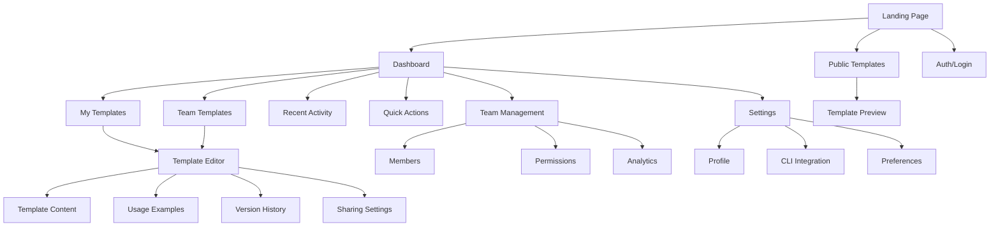
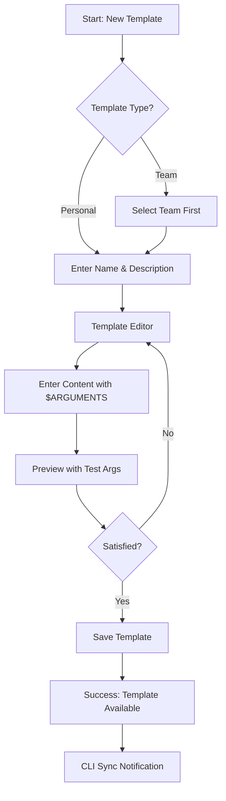
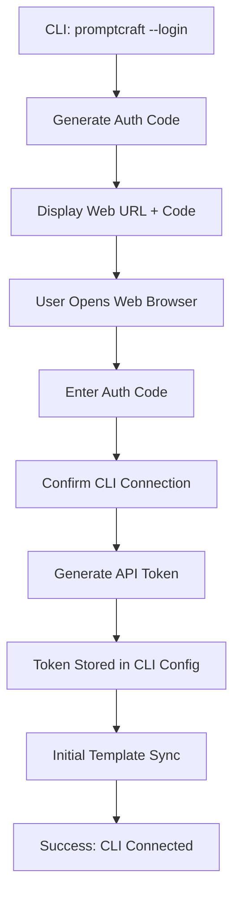
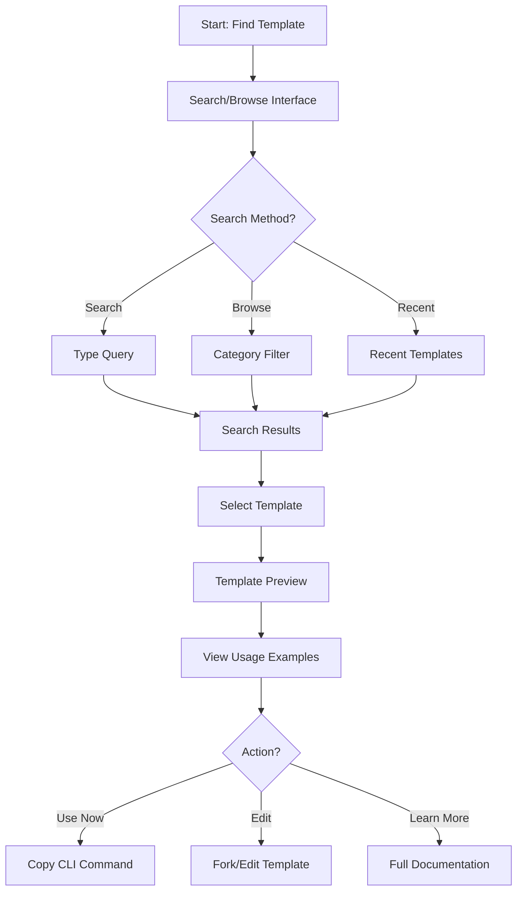

# PromptCraft UI/UX Specification

## Introduction

This document defines the user experience goals, information architecture, user flows, and visual design specifications for PromptCraft's user interface. It serves as the foundation for visual design and frontend development, ensuring a cohesive and user-centered experience.

### Overall UX Goals & Principles

#### Target User Personas

**Primary Developer (CLI Power User)**
- Technical professionals who live in terminals and code editors
- Value speed, keyboard shortcuts, and minimal cognitive overhead
- Need seamless sync between CLI and web interfaces
- Skeptical of web interfaces that slow them down

**Team Lead (Collaboration Facilitator)**
- Manages prompt standards across development teams
- Needs visibility into team template usage and consistency
- Requires approval workflows and access control
- Wants analytics on prompt effectiveness

**New Developer (Discoverability Seeker)**
- Newer team members discovering prompt templates
- Benefits from visual template browsing and examples
- Needs onboarding guidance and best practices
- Values clear documentation and usage examples

#### Usability Goals

- **CLI Performance Parity:** Web interface operations must feel as fast as CLI (<200ms response times)
- **Zero Learning Curve:** Existing CLI users can immediately understand web interface patterns
- **Seamless Multi-Modal Usage:** Users can switch between CLI and web without friction
- **Team Collaboration Without Complexity:** Adding team features doesn't complicate individual workflows

#### Design Principles

1. **Speed Over Beauty** - Every design decision optimized for developer productivity
2. **CLI-First Mental Models** - Web interface mirrors familiar command-line concepts
3. **Progressive Enhancement** - Core functionality works without JavaScript, enhanced with it
4. **Contextual Collaboration** - Team features appear only when relevant, never intrusive
5. **Developer Aesthetic** - Clean, terminal-inspired design that developers trust and respect

### Change Log
| Date | Version | Description | Author |
|------|---------|-------------|--------|
| 2025-09-01 | 1.0 | Initial frontend specification | Sally (UX Expert) |

## Information Architecture (IA)

### Site Map / Screen Inventory

### Navigation Structure

**Primary Navigation:** Minimal top bar with logo, search, user menu
- Emphasizes search-first discovery (like CLI `--list`)
- User menu provides access to settings and team switching

**Secondary Navigation:** Context-sensitive sidebar
- Dashboard: Templates, Teams, Settings
- Template Editor: Content, Examples, History, Sharing
- Team Management: Members, Permissions, Analytics

**Breadcrumb Strategy:** File-path style breadcrumbs matching CLI mental model
- Format: `Home / Team: acme-corp / Templates / api-review`
- Clickable path segments for quick navigation
- Shows current context clearly for CLI users

## User Flows

### Template Creation Flow

**User Goal:** Create a new prompt template quickly and efficiently

**Entry Points:** 
- Dashboard "New Template" button
- Keyboard shortcut (Cmd/Ctrl + N)
- CLI sync import

**Success Criteria:** Template created and available for immediate use via CLI and web

#### Flow Diagram

#### Edge Cases & Error Handling:
- Template name conflicts (suggest alternatives)
- Invalid $ARGUMENTS syntax (real-time validation)
- Network failures during save (local draft persistence)
- Team permission errors (clear error messages)

**Notes:** Template creation must feel as fast as creating a file in a text editor. Auto-save drafts locally, sync when connected.

### CLI Integration Flow

**User Goal:** Authenticate web account with CLI tool for seamless synchronization

**Entry Points:**
- CLI command: `promptcraft --login`
- Web dashboard "CLI Setup" guide
- First-time CLI sync prompt

**Success Criteria:** CLI authenticated and templates synced bidirectionally

#### Flow Diagram

#### Edge Cases & Error Handling:
- Invalid auth codes (regenerate with clear instructions)
- Token expiration (automatic refresh)
- Sync conflicts (show diff, allow user choice)
- Offline usage (CLI continues working, sync when online)

**Notes:** Authentication flow inspired by GitHub CLI - familiar to developers. One-time setup, then transparent sync.

### Template Discovery Flow

**User Goal:** Find and use existing templates from personal library or team collection

**Entry Points:**
- Dashboard search bar
- Browse templates page
- CLI `promptcraft --list` equivalent

**Success Criteria:** User finds relevant template and understands how to use it

#### Flow Diagram

#### Edge Cases & Error Handling:
- No search results (suggest similar terms, show popular templates)
- Template access denied (clear permission explanation)
- Broken templates (validation warnings)
- Outdated examples (version mismatch warnings)

**Notes:** Discovery should feel like exploring a well-organized file system. Emphasize quick preview and immediate action.

## Wireframes & Mockups

**Primary Design Files:** Figma workspace at [figma.com/promptcraft-design] (to be created)

### Key Screen Layouts

#### Dashboard - Main Interface

**Purpose:** Central hub for template management and quick access to all features

**Key Elements:**
- Quick search bar (prominent, always accessible)
- Template grid with preview cards
- Recent activity feed
- Quick action toolbar
- Team switcher (if multiple teams)

**Interaction Notes:** 
- Search supports fuzzy matching like CLI
- Template cards show usage count and last modified
- Hover shows quick preview of template content
- Right-click context menu for power users

**Design File Reference:** Figma Frame: Dashboard-v1

#### Template Editor

**Purpose:** Rich editor for creating and modifying prompt templates

**Key Elements:**
- Monaco editor (VS Code editor component) for template content
- Live preview pane with argument testing
- Metadata sidebar (name, description, tags)
- Version history panel
- Sharing and permissions controls

**Interaction Notes:**
- Syntax highlighting for $ARGUMENTS placeholders
- Auto-completion for common prompt patterns
- Real-time collaboration indicators
- Keyboard shortcuts match common editors

**Design File Reference:** Figma Frame: Editor-v1

#### Template Library

**Purpose:** Browse and discover templates from personal and team collections

**Key Elements:**
- Filterable grid layout
- Category tags and search facets
- Usage statistics and ratings
- Quick preview modal
- Bulk actions toolbar

**Interaction Notes:**
- Infinite scroll for large collections
- Keyboard navigation (arrow keys, enter to select)
- Quick copy CLI command to clipboard
- Batch operations for team management

**Design File Reference:** Figma Frame: Library-v1

## Component Library / Design System

**Design System Approach:** Custom system built on Shadcn/ui foundation, customized for developer aesthetic and terminal-inspired patterns

### Core Components

#### CommandInput
**Purpose:** Search and command input component mimicking CLI interface

**Variants:** 
- Search mode (template discovery)
- Command mode (quick actions)
- Argument input (template testing)

**States:** 
- Default, focused, loading, error
- Auto-complete dropdown active

**Usage Guidelines:** Always provide keyboard shortcuts and support fuzzy matching. Visual style should evoke terminal/command line.

#### TemplateCard
**Purpose:** Display template information in grid and list layouts

**Variants:**
- Compact (list view)
- Detailed (grid view)
- Preview (modal/drawer)

**States:**
- Default, hover, selected, loading
- Team vs personal indicators
- Access level badges

**Usage Guidelines:** Show essential information at a glance. Usage statistics help users identify quality templates.

#### CodeEditor
**Purpose:** Rich text editing for template content with syntax highlighting

**Variants:**
- Full editor (template creation)
- Preview mode (read-only)
- Inline editor (quick edits)

**States:**
- Editing, preview, diff view
- Collaboration cursors
- Error/validation states

**Usage Guidelines:** Based on Monaco Editor for familiarity. Highlight $ARGUMENTS syntax prominently.

## Branding & Style Guide

### Visual Identity
**Brand Guidelines:** Developer-focused, clean, and functional aesthetic inspired by modern CLI tools and code editors

### Color Palette
| Color Type | Hex Code | Usage |
|------------|----------|-------|
| Primary | #0066CC | Links, primary actions, CLI accent color |
| Secondary | #4A5568 | Secondary text, subtle backgrounds |
| Accent | #00D9FF | Success states, new features, highlights |
| Success | #10B981 | Confirmations, successful operations |
| Warning | #F59E0B | Cautions, validation warnings |
| Error | #EF4444 | Errors, destructive actions |
| Neutral | #F7FAFC, #E2E8F0, #4A5568 | Backgrounds, borders, body text |

### Typography

#### Font Families
- **Primary:** Inter (clean, readable, developer-friendly)
- **Secondary:** System UI stack (platform consistency)
- **Monospace:** JetBrains Mono (code, CLI commands, templates)

#### Type Scale
| Element | Size | Weight | Line Height |
|---------|------|--------|-------------|
| H1 | 2rem | 600 | 1.2 |
| H2 | 1.5rem | 600 | 1.3 |
| H3 | 1.25rem | 500 | 1.4 |
| Body | 0.875rem | 400 | 1.5 |
| Small | 0.75rem | 400 | 1.4 |

### Iconography
**Icon Library:** Lucide React icons for consistency and developer familiarity

**Usage Guidelines:** 
- 16px and 20px sizes for UI elements
- 24px for primary actions and headers
- Consistent stroke width (1.5px)
- Prefer outlined style over filled for better scalability

### Spacing & Layout
**Grid System:** 8px base unit with 4px increments for fine adjustments

**Spacing Scale:** 4, 8, 12, 16, 20, 24, 32, 40, 48, 64, 80, 96px

## Accessibility Requirements

### Compliance Target
**Standard:** WCAG 2.1 AA compliance with developer-specific enhancements

### Key Requirements

**Visual:**
- Color contrast ratios: 4.5:1 for normal text, 3:1 for large text
- Focus indicators: 2px solid outline with high contrast
- Text sizing: Supports browser zoom up to 200% without horizontal scrolling

**Interaction:**
- Keyboard navigation: Full app navigable with tab, arrow keys, and shortcuts
- Screen reader support: Semantic HTML with ARIA labels for complex interactions
- Touch targets: Minimum 44px click targets for mobile usage

**Content:**
- Alternative text: Descriptive alt text for all informational images
- Heading structure: Logical heading hierarchy (h1 → h2 → h3)
- Form labels: Clear, descriptive labels for all form inputs

### Testing Strategy
- Automated testing with axe-core in CI pipeline
- Manual testing with keyboard-only navigation
- Screen reader testing with NVDA and VoiceOver
- Color blindness simulation for all UI states

## Responsiveness Strategy

### Breakpoints
| Breakpoint | Min Width | Max Width | Target Devices |
|------------|-----------|-----------|----------------|
| Mobile | 320px | 767px | Phones, small tablets |
| Tablet | 768px | 1023px | iPads, large tablets |
| Desktop | 1024px | 1439px | Laptops, standard monitors |
| Wide | 1440px | - | Large monitors, ultrawide displays |

### Adaptation Patterns

**Layout Changes:** 
- Mobile: Single column stack with collapsible navigation
- Tablet: Two-column layout with sidebar
- Desktop: Multi-column dashboard with persistent navigation
- Wide: Additional panels for advanced features

**Navigation Changes:**
- Mobile: Hamburger menu with full-screen overlay
- Tablet+: Persistent sidebar with collapsible sections
- All sizes: Search remains prominent and accessible

**Content Priority:**
- Mobile-first: Essential actions and content prioritized
- Progressive enhancement: Additional features revealed on larger screens
- Context-sensitive: Show relevant tools based on current task

**Interaction Changes:**
- Mobile: Touch-optimized buttons and gesture support
- Desktop: Keyboard shortcuts and hover states prominent
- All sizes: Consistent core interactions across platforms

## Animation & Micro-interactions

### Motion Principles
- **Purposeful Motion:** Every animation serves a functional purpose
- **Respect System Preferences:** Honor reduced-motion settings
- **Performance First:** 60fps animations, minimal GPU usage
- **Developer-Appropriate:** Subtle, professional, not distracting

### Key Animations
- **Page Transitions:** Slide transitions between major sections (300ms, ease-out)
- **Loading States:** Skeleton screens and subtle pulse animations (1s loop, linear)
- **Hover Feedback:** Button and card hover states (150ms, ease-in-out)
- **Focus Management:** Focus ring animations for keyboard navigation (200ms, ease-out)
- **Success Feedback:** Checkmark animations for completed actions (500ms, ease-out)
- **Error States:** Gentle shake animation for validation errors (400ms, ease-in-out)
- **Search Results:** Stagger animation for search result appearance (100ms offset, ease-out)

## Performance Considerations

### Performance Goals
- **Page Load:** First meaningful paint under 1.5 seconds
- **Interaction Response:** UI feedback within 100ms, completion under 200ms
- **Animation FPS:** Maintain 60fps for all animations

### Design Strategies
- **Lazy Loading:** Template content and images loaded on demand
- **Virtual Scrolling:** Large template lists rendered efficiently
- **Optimistic Updates:** UI updates immediately, sync in background
- **Progressive Enhancement:** Core functionality works without JavaScript
- **Asset Optimization:** SVG icons, optimized images, minimal bundle size
- **Caching Strategy:** Aggressive caching for templates and UI components

## Next Steps

### Immediate Actions
1. Create Figma design system with components defined above
2. Build interactive prototypes for key user flows
3. Conduct usability testing with target developer personas
4. Define detailed interaction specifications for complex components
5. Create comprehensive component library documentation
6. Plan phased implementation roadmap with architecture team

### Design Handoff Checklist
- [x] All user flows documented
- [x] Component inventory complete
- [x] Accessibility requirements defined
- [x] Responsive strategy clear
- [x] Brand guidelines incorporated
- [x] Performance goals established

### Additional Considerations
- **CLI Integration Testing:** Validate sync workflows with real CLI usage
- **Developer Feedback Loop:** Establish process for ongoing user research
- **Documentation System:** Plan for comprehensive design system docs
- **Internationalization:** Consider future i18n requirements
- **Dark Mode:** Plan dark theme variant for developer preference

## Checklist Results

Frontend specification complete with comprehensive UX guidelines, component definitions, and implementation roadmap. Document provides clear direction for design system creation and development handoff while maintaining focus on developer-centric user experience principles.

**Key Deliverables:**
- ✅ Complete user persona definitions with specific developer focus
- ✅ Detailed information architecture and navigation strategy
- ✅ Critical user flow documentation with edge case handling
- ✅ Component library specifications with usage guidelines
- ✅ Developer-appropriate visual design system
- ✅ Comprehensive accessibility and performance requirements
- ✅ Responsive design strategy for all device types
- ✅ Clear next steps for design implementation

The specification balances the need to evolve from CLI tool to collaborative platform while preserving the speed and efficiency that makes the original tool successful.